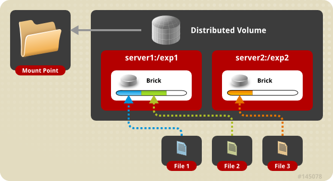

# 创建卷
**卷是brick(信任存储池(truseted storage pool)中的服务暴露的目录)的逻辑组合。在你的存储环境里创建新卷，需要指定组成卷的brick。创建卷后，必须要先启动才能尝试挂载。**  
  
如何创建brick请查看[挂载存储](https://docs.gluster.org/Administrator-Guide/setting-up-storage/)  
## 卷类型
+ 如下类型的卷可以在你的存储环境中创建
  + **分布式卷（Distributed）**   分布式卷分发文件到卷中的所有brick中。在你需要可扩展存储且冗余是不重要或者已经由其他硬件或者软件提供了冗余的时候，选择使用分布式卷。
  + **副本卷（Replicated）**   副本卷复制文件到卷中的所有brick中。你可以在对高可用（high-availability）和高可靠（high-reliability）要求最紧急的场景下使用副本卷。
  + **分布式副本卷（Distributed Replicated）**  分布式副本卷分发文件到卷的整个副本brick中。你可以在需要可扩展存储且高可靠性（high-reliability）至关重要的环境中使用分布式复制卷。在大多数场景下，他可以提供读的性能提升。
  + **分散卷（Dispersed）**  分散卷卷基于纠删码（erasure code），提供节省空间且防止磁盘和服务故障导致数据丢失的能力。它将原始文件的编码碎片存储到每个brick中，只需碎片的子集即可恢复原始文件。在不丢失数据访问权限的情况下可以丢失的brick数量由管理员在创建卷时配置。
  + **分布式分散卷（Distributed Dispersed）**  分布式分散卷在卷的分散卷子卷中分发文件。和分布式副本卷有同样的优，但是使用分散卷在brick中存储数据。
    
**创建卷**

+ 创建一个新的卷
    `#gluster volume create <NEW-VOLNAME> [[replica <COUNT> [arbiter <COUNT>]]|[replica 2 thin-arbiter 1]] [disperse [<COUNT>]] [disperse-data <COUNT>] [redundancy <COUNT>] [transport <tcp|rdma|tcp,rdma>] <NEW-BRICK> <TA-BRICK>... [force]`  
    例如，创建一个叫test-volume的卷，由server3:/exp3 和 server4:/exp4 组成:  
    `#gluster volume create test-volume server3:/exp3 server4:/exp4`  

## 创建分布式卷
分布式卷中，文件被随机的分布到到卷的brick中。在需要可扩展存储且冗余不重要或已经由其他硬件/软件层提供的场景下，你可以使用分布式卷。  
*注意：基于目录和内容是随机的分布在卷的brick中，磁盘/服务故障会导致严重的数据丢失*  

